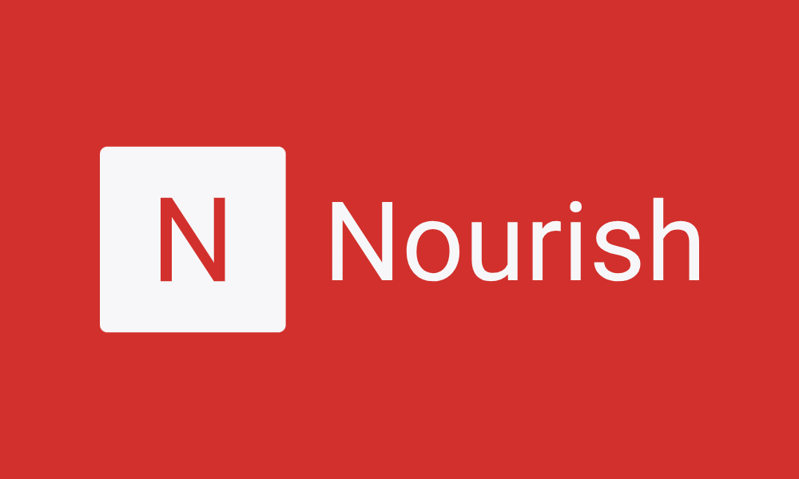

 

# Nourish Restaurant

Nourish Restaurant is an innovative platform designed to revolutionize the dining experience for health-conscious individuals in urban areas. Our goal is to provide a convenient and sustainable solution for those seeking nutritious and delicious meals on-the-go. Targeted primarily at busy professionals and fitness enthusiasts, Nourish Restaurant offers a diverse menu of fresh, organic, and locally sourced dishes that cater to various dietary preferences, including vegan, gluten-free, and low-carb options. Our intuitive platform allows users to easily browse our menu, place orders for pickup or delivery, and even customize their meals to suit their individual preferences.

In addition to providing wholesome food options, Nourish Restaurant is committed to sustainability and environmental responsibility. We prioritize eco-friendly packaging, minimize food waste through efficient inventory management, and support local farmers and producers to reduce our carbon footprint. With Nourish Restaurant, you can enjoy guilt-free dining that nourishes both your body and the planet.

Join us on our mission to redefine fast food and empower individuals to make healthier choices without compromising on taste or convenience. Experience the joy of nourishing your body and satisfying your taste buds with Nourish Restaurant today!

## Responsive Mockup

The mockups for this project are meant to showcase the responsive design and layout of my website across various devices and screen sizes. However, due to some bugs that were unresolved, I am only able to provide thThese visual representations provide a glimpse into how my accuratly site adapts to different resolutions, ensuring an optimal user experience regardless of whether it's accessed on a desktop, tablet, or smartphone. Ultimately, by meticulously designing and testing these mockups, we aim to demonstrate our commitment to usability and accessibility, ultimately enhancing the overall functionality and appeal of our website.

## FrontEnd/UI/UX Design

I planned out the pages of my website andcreated the wireframes using Balsamiq to bring them to life: 

## Features

The Nourish Restaurant website is meticulously crafted to provide an enriching experience for visitors while showcasing the culinary delights and ambiance of the establishment. Tailored to meet the needs of both prospective diners and loyal patrons, the website serves as a digital gateway to the restaurant's offerings. Here's an overview of its key features:

### Existing Features

#### Navigation Bar

- Prominently displayed across all pages, the navigation bar offers intuitive access to essential sections such as the Home page, Menu, Reservations, About Us, and Contact.
- Ensures seamless navigation across all devices without needing to use the browser's back button.

#### Landing Page

-  The landing page welcomes visitors with captivating visuals, providing a tantalizing glimpse into the restaurant's ambiance, cuisine, and dining experience.
- High-quality images, strategically placed, evoke a sense of anticipation and invite users to delve deeper into the website.

#### Menu Showcase

-  Highlighting the diverse array of culinary offerings, the Menu section provides a comprehensive overview of the restaurant's dishes, beverages, and specials. 
- Organized categorically and accompanied by enticing descriptions and visuals, the menu entices visitors to explore the gastronomic delights awaiting them.

#### Reservation System

- Seamlessly integrated into the website, the reservation system enables users to book tables for their desired date, time, and party size.
- With a user-friendly interface and real-time availability updates, the system simplifies the booking process and enhances customer convenience.

#### Footer

- Includes links to Nourish.'s social media platforms, facilitating easy communication and connection with the community.

#### About Us Page

- Offering insights into the restaurant's history, philosophy, and culinary ethos, the About Us page provides context and depth to the dining experience.
-  Visitors can learn about the restaurant's journey, values, chef's philosophy, and commitment to sustainability, fostering a deeper connection with the brand.

#### Sign Up Page

- Enables users to sign up to the site, allowing them to specify their preferences for meals and granting varying levels of access depending on the user.
- Collects user information such as full name and email address for account detail storage and table booking.

### Features Left to Implement

- Chef's specials notifications.
- Online ordering functionality.
- Customer loyalty programs may further enrich the website's offerings, catering to evolving customer preferences and enhancing overall user satisfaction.

## Testing

### Validator Testing

- No errors were returned when passing through the official W3C HTML validator.
- No errors were found when passing through the official W3C CSS validator.

### Unfixed Bugs

- Currently, there are a few unfixed bugs in the Nourish Restaurant website. However, thorough testing is ongoing to identify and address issues promptly.

## Deployment

The Nourish Restaurant website was deployed using Heroku App. Follow these steps to deploy the site:

1. In the Deploy tab on Heroku, link Github repo.
2. Once the correct repo is linked, scroll down an click 'Deploy Branch' to begin deployment.
3. If all goes right you will see 'Your app was successfully deployed', click 'View' underneath to display live site.
3. The live link to the deployed site can be found [here](https://nourish1-e4f3558963a4.herokuapp.com/).

## Credits

### Content

- Instructions on form validation implementation on the Sign Up page were derived from a specific YouTube tutorial.
- Some front end code was derived from a specific Youtube tutorial with the source code found [here] (https://github.com/codewithsadee/foodie)
- Planning of this project was done using Github Kanban which can be found [here] (https://github.com/users/ubachicodes/projects/3) also my Issues/Milestones are documented [here] (https://github.com/ubachicodes/restaurant/issues).
  
### Media

- Photos used on the home and sign-up pages were sourced from an open-source site.
- High-quality images featured on the website were sourced from professional photographers and stock photo websites, ensuring visual appeal and authenticity.

### Acknowledgements
Special thanks to the Code Institute team for their dedication and support in helping bring the Nourish Restaurant website to life.